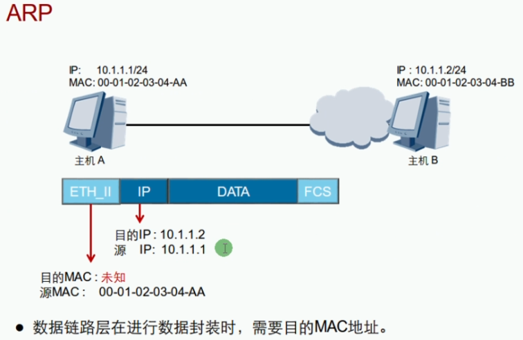
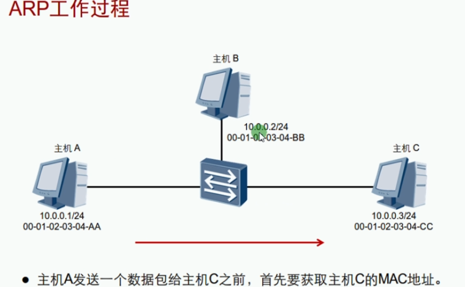
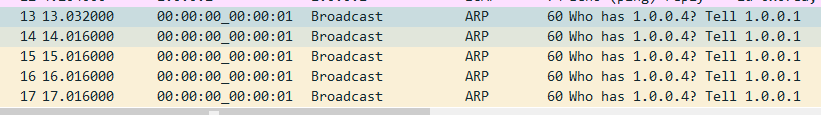
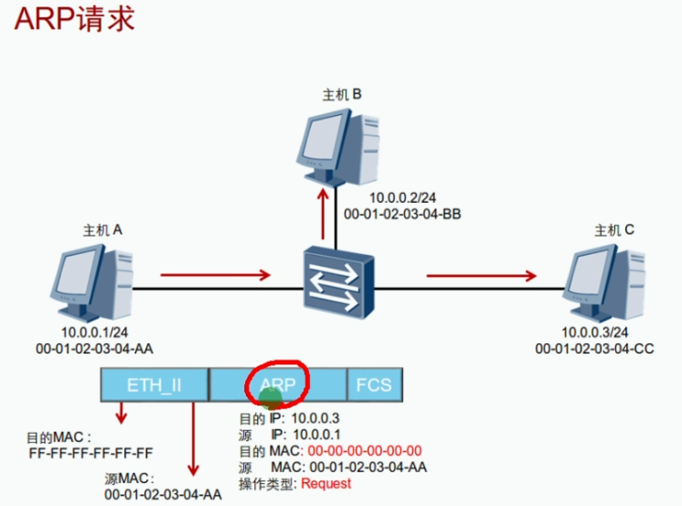
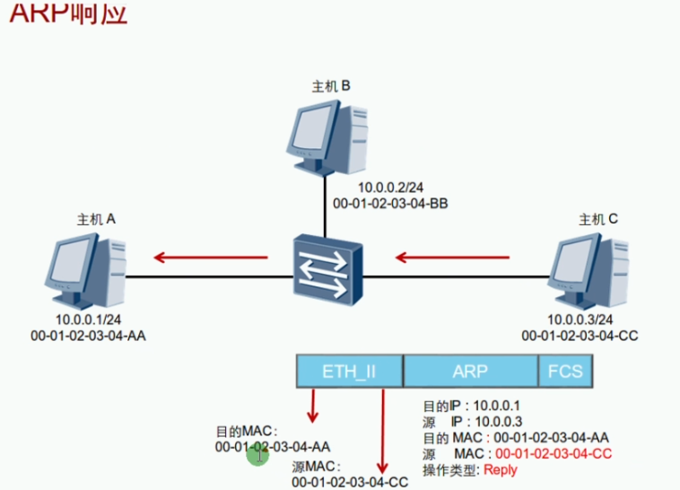
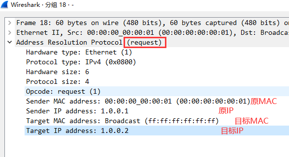
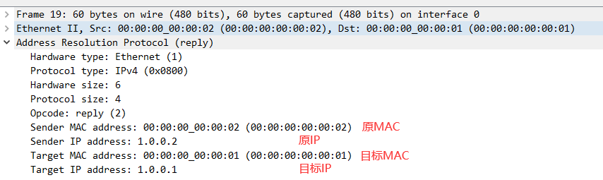

 https://www.bilibili.com/video/BV1Dg4y187bZ?p=12 

# 网络层

## ARP:地址解析协议

### 前言

网络设备有数据要发送给另一台网络设备时，必须知道对方的网络层地址（即IP地址）。IP地址由网络层来提供，但是仅有IP地址是不够的，IP数据报文必须封装成帧才能通过数据链路进行发送。数据帧必须要半酣目的MAC地址，因为发送端还必须获取到目的地的MAC地址。通过目的的IP地址而获取目的MAC地址的过程由ARP协议实现。





## 通讯示例



```bash
//查看arp缓存
arp -a
//清空arp缓存
arp -d
```





### ARP抓包

目标MAC	ff:ff:ff:ff:ff:ff	=》广播 	在一个广播域里面的所有人都会收到





