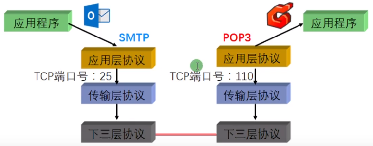
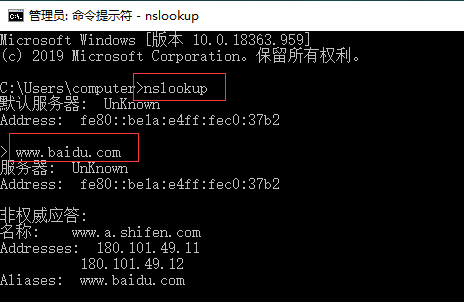
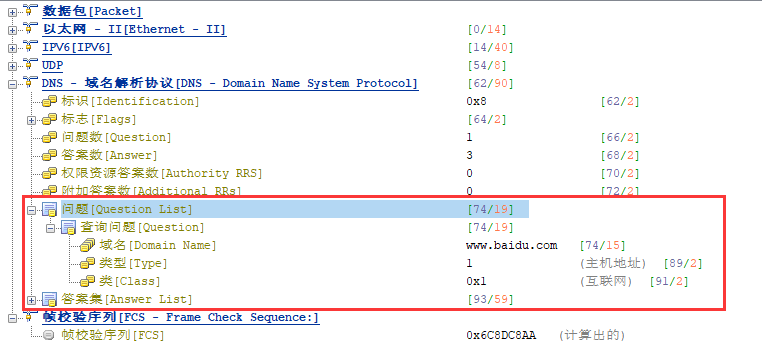

## 应用层

#### 应用层概述：

* TCP/IP模型的最高层
* 直接为应用提供网络服务



#### 常用的应用层协议：

* DNS
* HTTP
* SMTP与POP3/IMAP
* Telnet
* FTP与TFTP

#### DNS：域名解析服务

什么是域名

www.baidu.com www.jd.com

域名的作用：好记


#### 如何抓取DNS包

```bash
C:\Users\computer>nslookup
默认服务器:  UnKnown
Address:  fe80::be1a:e4ff:fec0:37b2

> www.baidu.com
服务器:  UnKnown
Address:  fe80::be1a:e4ff:fec0:37b2

非权威应答:
名称:    www.a.shifen.com
Addresses:  180.101.49.11
          180.101.49.12
Aliases:  www.baidu.com
```



抓包结果：


查询什么问题



问谁查询


答案


|         命令         |    备注     |
| :------------------: | :---------: |
|       nslookup       | DNS调式工具 |
| ipconfig /displaydns | 查看DNS缓存 |
|  ipconfig /flushdns  | 清楚DNS缓存 |

#### ENSP创建DNS服务器以及实验

网络拓扑图


服务器配置DNS和启动DNS服务


然后我们使用1.0.0.1的PC去Ping www.baidu.com


可以看到Ping通了,然后我们抓包看一下


我们可以看到DNS抓的包

