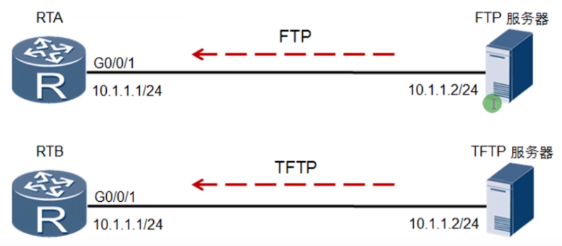

 https://www.bilibili.com/video/BV1Dg4y187bZ?p=9 

# FTP和TFTP

| 协议 |                             备注                             |
| :--: | :----------------------------------------------------------: |
| FTP  |  文件传输协议：提供可靠的文件茶树服务(具有认证、权限等功能)  |
| TFTP | 简单文件传输协议：提供不可靠的文件传输协议，常用于网络设备的配置文件和系统文件传输 |
|      |                                                              |

### FTP地址示例和详解

ftp://ftp.sjtu.edu.cn/index2.html

ftp://服务器的IP或者域名/路径/文件名

ftp://用户名:密码:@IP或者域名:端口号

