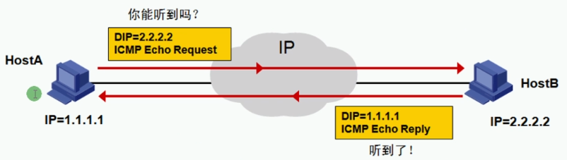
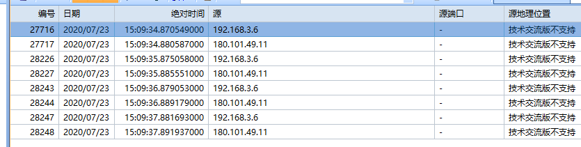
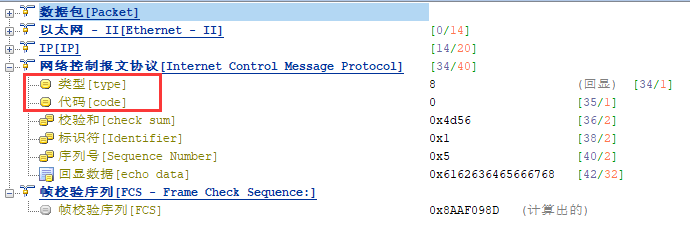
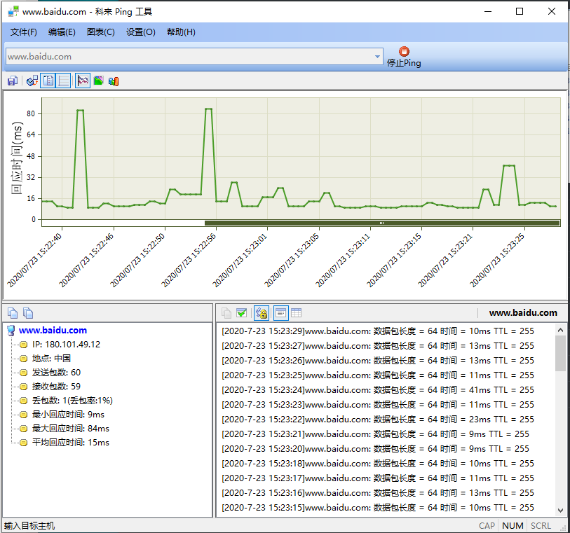

 https://www.bilibili.com/video/BV1Dg4y187bZ?p=13 

# ICMP：因特网控制消息协议

## 前言

* Internet控制报文协议ICMP是网络层的一个重要协议。ICMP协议用来在网络设备间传递各种差错和控制信息，他对于手机各种网络信息、诊断和排除各种网络故障有至关重要的作用。使用基于ICMP的应用时，需要对ICMP的工作原理非常熟悉。

* 用于可达性测试
* 使用ping命令调用



```
C:\Users\computer>ping www.baidu.com

正在 Ping www.a.shifen.com [180.101.49.11] 具有 32 字节的数据:
来自 180.101.49.11 的回复: 字节=32 时间=10ms TTL=53
来自 180.101.49.11 的回复: 字节=32 时间=10ms TTL=53
来自 180.101.49.11 的回复: 字节=32 时间=10ms TTL=53
来自 180.101.49.11 的回复: 字节=32 时间=10ms TTL=53

180.101.49.11 的 Ping 统计信息:
    数据包: 已发送 = 4，已接收 = 4，丢失 = 0 (0% 丢失)，
往返行程的估计时间(以毫秒为单位):
    最短 = 10ms，最长 = 10ms，平均 = 10ms

C:\Users\computer>
```





| 类型 | 编码 |     描述     |
| :--: | :--: | :----------: |
|  0   |  0   |  Echo Reply  |
|  3   |  0   |  网络不可达  |
|  3   |  1   |  主机不可达  |
|  3   |  2   |  协议不可达  |
|  3   |  3   |  端口不可达  |
|  5   |  0   |    重定向    |
|  8   |  0   | Echo Request |

PING返回信息

* 无法访问目标主机(完全不在线，ARP无法获取mac)
* 请求超时(ARP获取到了mac，1.开了防火墙无法PING，2.对方主机不在线)
* 传输失败
* 成功

