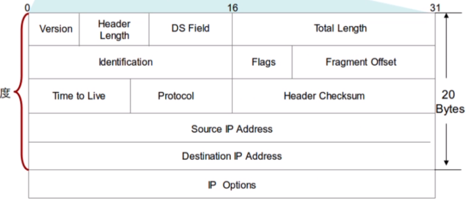
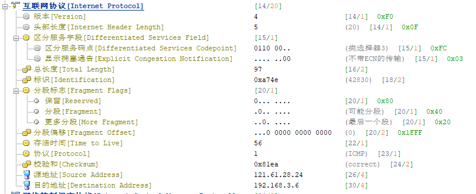
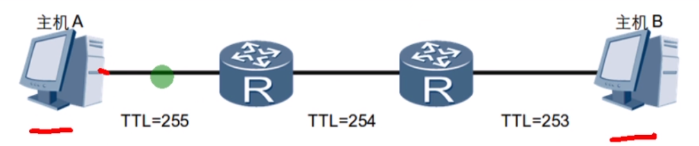
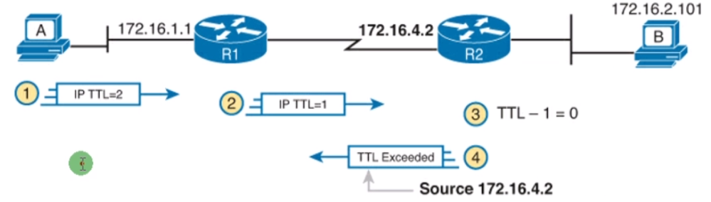

 https://www.bilibili.com/video/BV1Dg4y187bZ?p=14 

 https://www.bilibili.com/video/BV1Dg4y187bZ?p=15

 https://www.bilibili.com/video/BV1Dg4y187bZ?p=16 

# IP因特网协议

## 前言

网络层位于数据链路层与传输层之间。网络层中包含了很多协议，其中最为重要的协议就是IP协议。网络层提供了IP路由功能。理解IP路由除了要熟悉IP协议的工作机制之外，还必须理解IP编址以及如何合理地使用IP地址来设计网络。

## IP地包头结构





**版本**：4/6	(ipv4/ipv6)

**头部长度**：5	(固定长度20)

**总长度**：包头长度+上层数据长度(传输层)

**标识**：0xa74e	(当出现分包的时候，通过标识区分)

**分段标志**：

* 保留：
* 分段：点亮 不要分段
* 更多分段：点亮 后面还有分段

**分段偏移量**： 0    （第一个包就是0，第二个就是1480）

**存活时间(TTL)**：

* 防止IP数据包在网络内无休止地传输(环路)

* 每经过一次路由TTL值就会减1

* 当TTL=0的时候，丢弃数据包

  

  

* 利用TTL特性，可以实现路由跟踪计算，排错的重要方法之一。

  相关命令：ping -i 或tracert -d

  ```bash
  C:\Users\computer>ping www.baidu.com -i 1
  
  正在 Ping www.a.shifen.com [180.101.49.12] 具有 32 字节的数据:
  来自 192.168.3.1 的回复: TTL 传输中过期。
  来自 192.168.3.1 的回复: TTL 传输中过期。
  来自 192.168.3.1 的回复: TTL 传输中过期。
  来自 192.168.3.1 的回复: TTL 传输中过期。
  
  180.101.49.12 的 Ping 统计信息:
      数据包: 已发送 = 4，已接收 = 4，丢失 = 0 (0% 丢失)，
  
  C:\Users\computer>
  ```

  ```
  C:\Users\computer>tracert -d www.baidu.com
  
  通过最多 30 个跃点跟踪
  到 www.a.shifen.com [180.101.49.11] 的路由:
  
    1     1 ms     1 ms     1 ms  192.168.3.1
    2     2 ms     1 ms     1 ms  192.168.1.1
    3     5 ms     3 ms     4 ms  180.108.155.1
    4     5 ms     6 ms     6 ms  218.4.211.181
    5     7 ms     7 ms     7 ms  221.224.235.213
    6    10 ms    10 ms    11 ms  58.213.95.118
    7     *        *       10 ms  58.213.95.90
    8    10 ms    10 ms    10 ms  58.213.96.114
    9    10 ms     9 ms     9 ms  10.166.50.4
   10    10 ms    11 ms    10 ms  10.166.50.8
   11    67 ms    65 ms    39 ms  10.166.96.12
   12     *       10 ms    10 ms  10.165.3.39
   13     9 ms     9 ms     9 ms  180.101.49.11
  
  跟踪完成。
  
  C:\Users\computer>
  ```

  为什么会出来星号？因为某些设备出来PING保护

### ENSP的安装

打开运行	F:\华为网络证书\安装包\软件\eNSP_Setup.exe

### TTL防环机制

