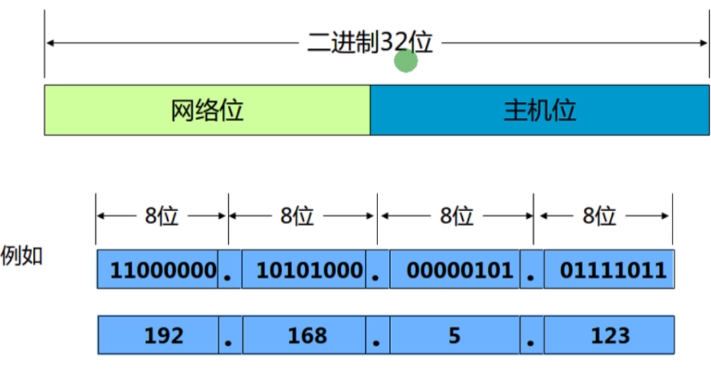
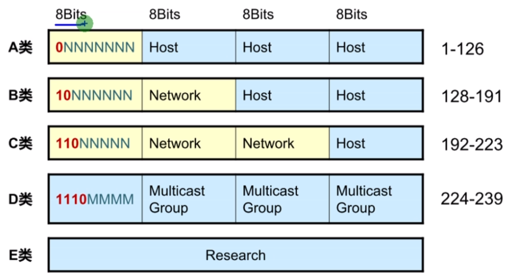
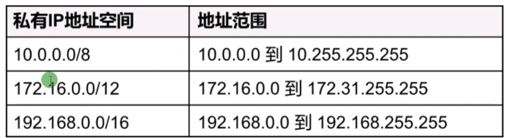
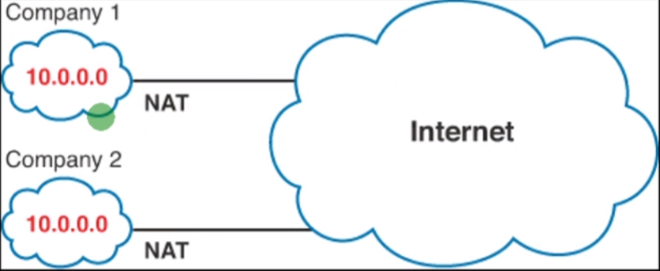
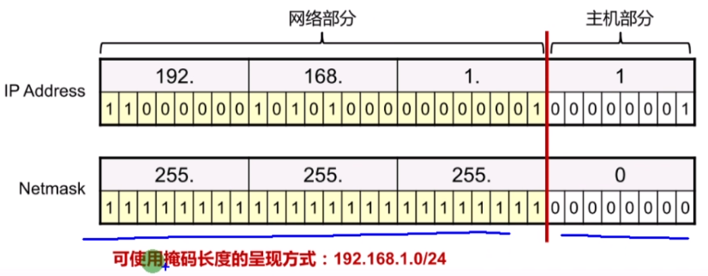
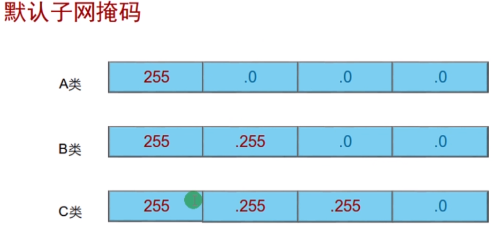

 https://www.bilibili.com/video/BV1Dg4y187bZ?p=18 

# IP基础

* 在IP网络中，通讯节点需要有IP地址
* 以点分十进制标识，由32位二进制组成
* 分为网络位和主机位两部分
  * 网络位，代表IP地址所属的网段
  * 主机位，代表网段上的某一节点
  * 由子网掩码决定分界点

0开头：所有地址，或者没地址

127开头：环回地址，表示自己	测试TCP/IP协议栈组件

| 公网地址 | 用于Internet，向ISP付费申请，全球唯一                        |
| -------- | ------------------------------------------------------------ |
| 私网地址 | 用于企业内部网络，不能用于Internet，免费使用，可以重复       |
| 地址转换 | 使用私网地址如果要访问Internet。必须转换为公网地址，该技术称为NAT |

## 子网掩码

* 用于区分网络部分和主机部分
* 1表示网络位，0表示主机位

218.100.128.0/17

​				1/7

​				2^7=128

218.100.128.0~218.100.255.255

### 网络地址、主机地址、广播地址

* 每个网段上都有两个特殊地址（最小和最大）不能分配给节点

| 网络地址 | 主机位全为0代表一个网段（头）                  |
| -------- | ---------------------------------------------- |
| 主机地址 | 主机位不全为0也不全为1代表一个网段内的一个节点 |
| 广播地址 | 主机位全为1代表一个网段内的所有节点（尾）      |

