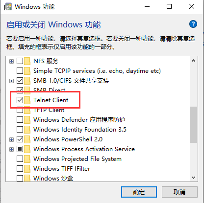

 https://www.bilibili.com/video/BV1Dg4y187bZ?p=8 

# Telnet

## Telnet 终端网络

* 远程管理的主要协议(网络设备、服务器、数据库等)
* 常用终端工具有：SecureCRT、Putty、Xshell

### Windows如何打开Telnet(不建议)

### 为什么Telnet抓包,服务器 返回数据是一份，命令出现两份

因为输入一次，服务器回一次显示，所以是两次

