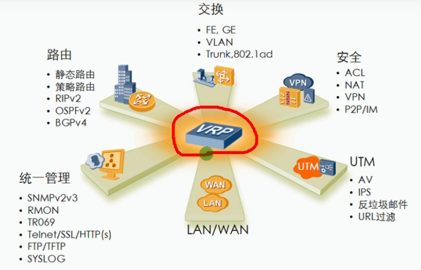
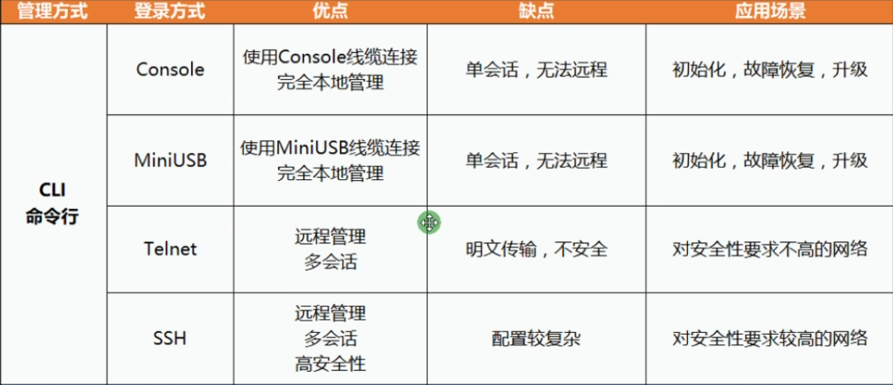
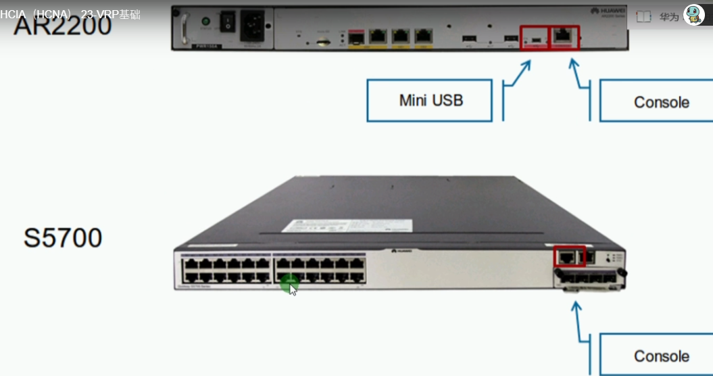
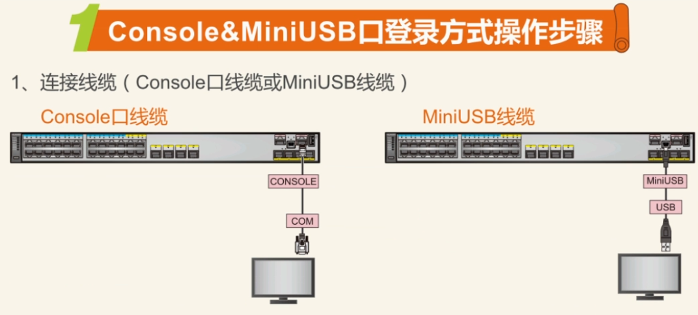
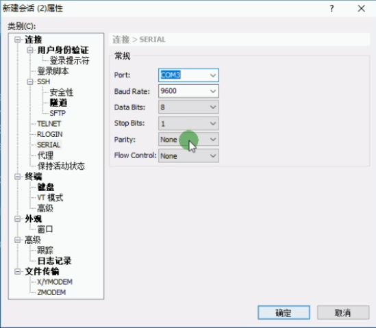
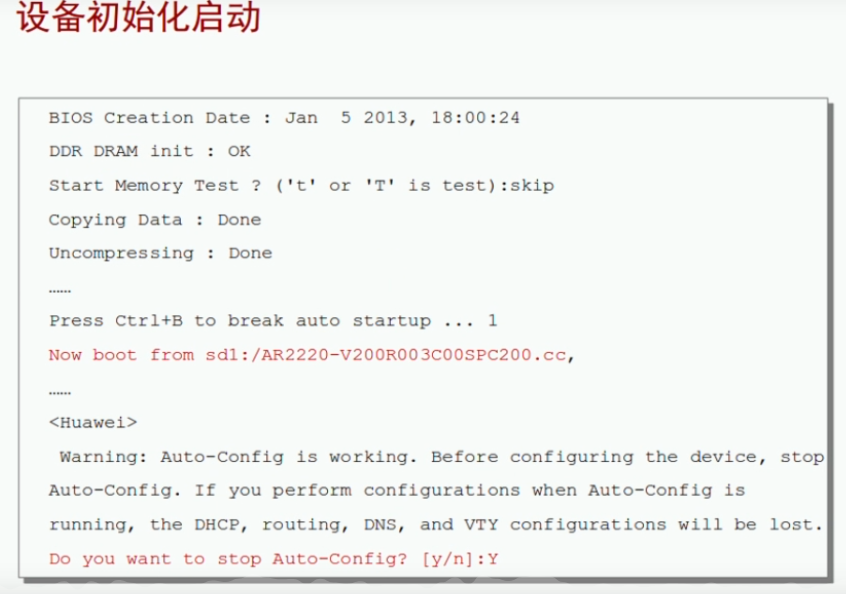
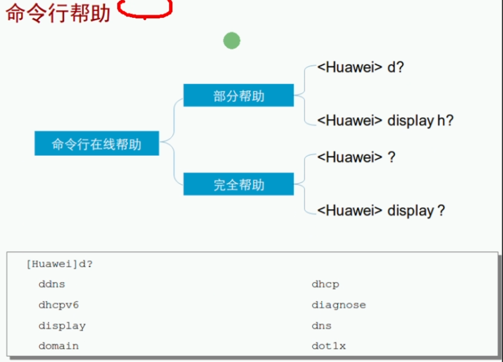
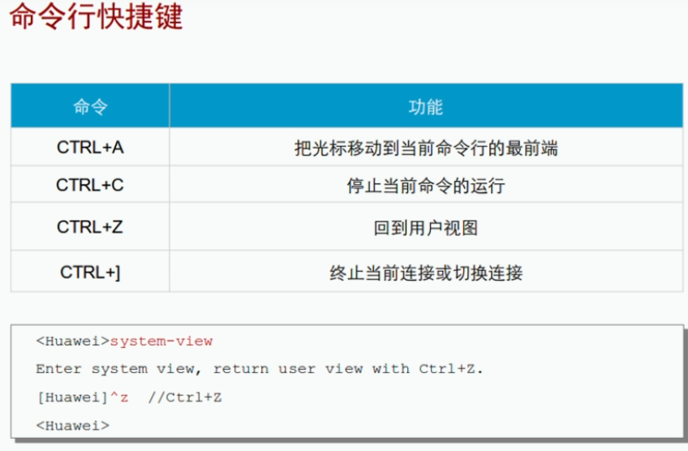

 https://www.bilibili.com/video/BV1Dg4y187bZ?p=23 

 https://www.bilibili.com/video/BV1Dg4y187bZ?p=24 

# VRP基础

交换机可以隔离冲突域，路由器可以隔离广播域，这两种设备在企业网络中应用越来越广泛。随着越来越多的终端接入到网络中，网络设备的负担也越来越重，这时网络设备可以通过专有的VRP系统来提升运行效率。通过路由平台VRP是华为公司数据通讯产品的通用操作系统平台，他以UP业务为核心，采用组件化的体系结构，在实现丰富功能特性的同时，还提供了基于应用的可裁剪和可扩展的功能,使得路由器和交换机的运行笑了大大增加。能对VRP熟练地进行配置和操作是对网络工程师地一种基本要求。

## VRP：通用路由平台

* 华为公司具有完全自主知识产权地网络操作系统
* 可以运行在多种硬件平台之上
* 拥有一致地网络界面、用户界面和管理界面，提供了灵活丰富地应用解决方案。
* 集成了路由交换计算、Qos技术、安全技术和IP语音技术等数据通讯功能












路由器的缺省用户名为admin，缺省密码为Admin@huawei

# VRP基础命令








| 视图名称                     | 前部显示情况       | 示例操作                 |
| ---------------------------- | ------------------ | ------------------------ |
| 用户视图(查看运行状态或其他) | <Huawei>           | 无                       |
| 系统视图(配置设备系统参数)   | [Huawei]           | system-view(sys)         |
| 接口视图(配置接口参数)       | [Huawei-LoopBack1] | interface lo 1(int lo 1) |
| 协议视图(配置路由协议)       |                    | ip add 1.0.0.1 24        |

为什么你打	**我是老司机**	很快？打命令很慢？

- 青铜：打全
- 黄金：Tab
- 大师：缩写
- 王者：敲白板

```bash
<Huawei>sys
Enter system view, return user view with Ctrl+Z.
[Huawei]int lo 1
[Huawei-LoopBack1]ip address 1.0.0.1 24
[Huawei]dis his			##查看历史命令
  sys
[Huawei]
[Huawei]dis his
  q
  int lo 2
  int lo 1
  sys
  dis his
[Huawei]dis int brief 	##查看所有接口的利用率
PHY: Physical
*down: administratively down
(l): loopback
(s): spoofing
(b): BFD down
^down: standby
(e): ETHOAM down
(d): Dampening Suppressed
InUti/OutUti: input utility/output utility
Interface                   PHY   Protocol InUti OutUti   inErrors  outErrors
Ethernet0/0/0               down  down        0%     0%          0          0
Ethernet0/0/1               down  down        0%     0%          0          0
Ethernet0/0/2               down  down        0%     0%          0          0
Ethernet0/0/3               down  down        0%     0%          0          0
Ethernet0/0/4               down  down        0%     0%          0          0
Ethernet0/0/5               down  down        0%     0%          0          0
Ethernet0/0/6               down  down        0%     0%          0          0
Ethernet0/0/7               down  down        0%     0%          0          0
Ethernet0/0/8               down  down        0%     0%          0          0
LoopBack1                   up    up(s)       0%     0%          0          0
LoopBack2                   up    up(s)       0%     0%          0          0
NULL0                       up    up(s)       0%     0%          0          0
[Huawei]
```

