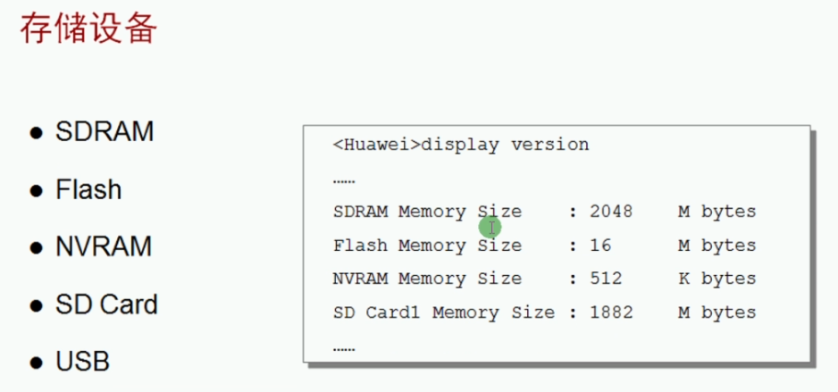
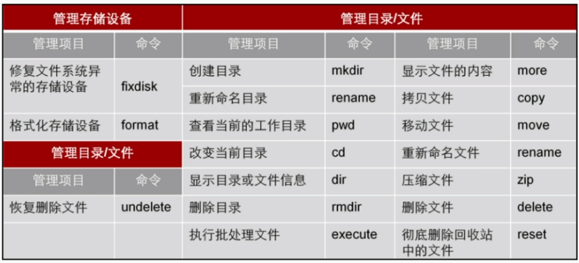
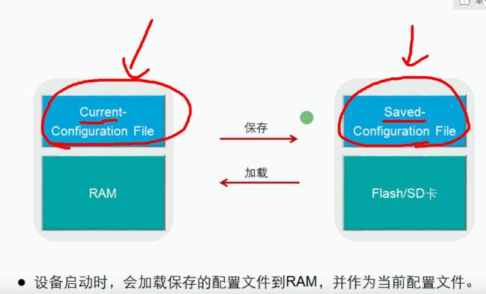

 https://www.bilibili.com/video/BV1Dg4y187bZ?p=26 

# VRP文件系统

### 前言

华为网络设备设备的配置文件和VRP系统文件都保存在物理存储介质中，所以文件系统是VRP正常运行的基础。只有掌握了对文件系统的基础操作，网络工程师才能对设备的配置文件和VRP系统文件进行高效的管理。

## 文件管理



```bash
[Huawei]dis version 
Huawei Versatile Routing Platform Software
VRP (R) software, Version 5.130 (AR2200 V200R003C00)
Copyright (C) 2011-2012 HUAWEI TECH CO., LTD
Huawei AR2220 Router uptime is 0 week, 0 day, 1 hour, 31 minutes
BKP 0 version information: 
1. PCB      Version  : AR01BAK2A VER.NC
2. If Supporting PoE : No
3. Board    Type     : AR2220
4. MPU Slot Quantity : 1
5. LPU Slot Quantity : 6

MPU 0(Master) : uptime is 0 week, 0 day, 1 hour, 31 minutes

### 虚拟机好像没有

MPU version information : 
1. PCB      Version  : AR01SRU2A VER.A
2. MAB      Version  : 0
3. Board    Type     : AR2220
4. BootROM  Version  : 0

[Huawei]
```



```bash
<Huawei>dir				## 查看当前目录中的文件	 	
Directory of flash:/

  Idx  Attr     Size(Byte)  Date        Time(LMT)  FileName 
    0  drw-              -  Jul 28 2020 02:52:54   dhcp
    1  -rw-        121,802  May 26 2014 09:20:58   portalpage.zip
    2  -rw-          2,263  Jul 28 2020 02:52:50   statemach.efs
    3  -rw-        828,482  May 26 2014 09:20:58   sslvpn.zip

1,090,732 KB total (784,464 KB free)
<Huawei>cd dhcp/ 		## 进入dhcp文件夹
<Huawei>dir 			## 查看dhcp文件夹信息
Directory of flash:/dhcp/

  Idx  Attr     Size(Byte)  Date        Time(LMT)  FileName 
    0  -rw-             98  Jul 28 2020 02:52:54   dhcp-duid.txt

1,090,732 KB total (784,464 KB free)
<Huawei>more dhcp-duid.txt 		## 查看dhcp文件内容
*Huawei DHCP DUID*
*time* 2020-07-28 10:52:54
*version* 1
#DUID_LL: 0003000100E0FC1463AC
*end*
<Huawei>cd ..					## 退出当前文件夹
<Huawei>dir						## 查看退出效果
Directory of flash:/

  Idx  Attr     Size(Byte)  Date        Time(LMT)  FileName 
    0  drw-              -  Jul 28 2020 02:52:54   dhcp
    1  -rw-        121,802  May 26 2014 09:20:58   portalpage.zip
    2  -rw-          2,263  Jul 28 2020 02:52:50   statemach.efs
    3  -rw-        828,482  May 26 2014 09:20:58   sslvpn.zip

1,090,732 KB total (784,464 KB free)
<Huawei>					
<Huawei>mkdir mm666				 ## 创建文件夹
Info: Create directory flash:/mm666......Done
<Huawei>dir						## 查看创建效果
Directory of flash:/

  Idx  Attr     Size(Byte)  Date        Time(LMT)  FileName 
    0  drw-              -  Jul 28 2020 04:44:18   mm666
    1  drw-              -  Jul 28 2020 02:52:54   dhcp
    2  -rw-        121,802  May 26 2014 09:20:58   portalpage.zip
    3  -rw-          2,263  Jul 28 2020 02:52:50   statemach.efs
    4  -rw-        828,482  May 26 2014 09:20:58   sslvpn.zip

1,090,732 KB total (784,460 KB free)
<Huawei>rmdir mm666				## 删除文件夹
Remove directory flash:/mm666? (y/n)[n]:y
%Removing directory flash:/mm666...Done!
<Huawei>reset recycle-bin 		 ## 清空回收站
Error: File can't be found
<Huawei>
<Huawei>mkdir mm666				## 重命名文件演示-新建文件夹
Info: Create directory flash:/mm666......Done
<Huawei>rename mm				
<Huawei>rename mm666 m6m6		## 重命名文件演示-重命名文件
Rename flash:/mm666 to flash:/m6m6? (y/n)[n]:y
Info: Rename file flash:/mm666 to flash:/m6m6 ......Done
<Huawei>dir						## 重命名文件演示-查看结果
Directory of flash:/

  Idx  Attr     Size(Byte)  Date        Time(LMT)  FileName 
    0  drw-              -  Jul 28 2020 02:52:54   dhcp
    1  -rw-        121,802  May 26 2014 09:20:58   portalpage.zip
    2  -rw-          2,263  Jul 28 2020 02:52:50   statemach.efs
    3  -rw-        828,482  May 26 2014 09:20:58   sslvpn.zip
    4  drw-              -  Jul 28 2020 05:44:29   m6m6

1,090,732 KB total (784,460 KB free)
<Huawei>					
<Huawei>copy dhcp-duid.txt mm123.txt		## 文件复制
Copy flash:/dhcp/dhcp-duid.txt to flash:/dhcp/mm123.txt? (y/n)[n]:y
100%  complete
Info: Copied file flash:/dhcp/dhcp-duid.txt to flash:/dhcp/mm123.txt...Done
<Huawei>dir								## 查看效果
Directory of flash:/dhcp/

  Idx  Attr     Size(Byte)  Date        Time(LMT)  FileName 
    0  -rw-             98  Jul 28 2020 02:52:54   dhcp-duid.txt
    1  -rw-             98  Jul 28 2020 05:49:25   mm123.txt

1,090,732 KB total (784,452 KB free)
<Huawei>
<Huawei>delete mm123.txt 				## 删除文件
Delete flash:/dhcp/mm123.txt? (y/n)[n]:y
Info: Deleting file flash:/dhcp/mm123.txt...succeed.
<Huawei>


```

## 配置文件保存



| 命令                      | 描述                 |
| ------------------------- | -------------------- |
| save                      | 保存配置文件         |
| compare configuration     | 比较配置文件         |
| reset saved-configuration | 重置配置文件         |
| reboot                    | 重启                 |
| dis startup               | 查看系统启动参数配置 |
|                           |                      |
| format flash              | 格式化               |

```bash
<mm>compare configuration							## 比较配置文件
 The current configuration is the same as the next startup configuration file.	## 配置文件相同
<mm>save										   ## 保存配置文件
  The current configuration will be written to the device. 
  Are you sure to continue? (y/n)[n]:y
  It will take several minutes to save configuration file, please wait......
  Configuration file had been saved successfully
  Note: The configuration file will take effect after being activated
<mm>
<mm>reset saved-configuration 						## 重置配置文件
This will delete the configuration in the flash memory.

The device configuratio
ns will be erased to reconfigure.

Are you sure? (y/n)[n]:y
 Clear the configuration in the device successfully.
<mm>
<mm>reboot 											## 重启
Info: The system is comparing the configuration, please wait.
Warning: All the configuration will be saved to the next startup configuration. 
Continue ? [y/n]:n									## 是否还原成之前的配置文件
System will reboot! Continue ? [y/n]:y
Info: system is rebooting ,please wait...
<mm>
Task FECD Init......Ok
Task MFPI Init......Ok
......
......
......
Task GVRP Init......Ok
Task ADPG Init......Ok

  Press any key to get started

<Huawei>dis sa										## 查看重启配置文件
<Huawei>dis saved-configurati
  There is no correct configuration file in FLASH
<Huawei>
Huawei>dir
Directory of flash:/

  Idx  Attr     Size(Byte)  Date        Time(LMT)  FileName 
    0  drw-              -  Jul 28 2020 05:52:24   dhcp
    1  -rw-        121,802  May 26 2014 09:20:58   portalpage.zip
    2  -rw-          2,263  Jul 28 2020 06:51:27   statemach.efs
    3  -rw-        828,482  May 26 2014 09:20:58   sslvpn.zip		
    4  -rw-            249  Jul 28 2020 06:16:09   private-data.txt
    5  drw-              -  Jul 28 2020 05:44:29   m6m6
    6  -rw-            120  Jul 28 2020 06:46:01   vrpcfg.zip			## 配置文件存储位置

1,090,732 KB total (784,448 KB free)
<Huawei>

```

### 启动配置文件

```bash
<Huawei>dis startup 
MainBoard: 
  Configured startup system software:        NULL
  Startup system software:                   NULL
  Next startup system software:              NULL
  Startup saved-configuration file:          NULL
  Next startup saved-configuration file:     NULL
  Startup paf file:                          NULL
  Next startup paf file:                     NULL
  Startup license file:                      NULL
  Next startup license file:                 NULL
  Startup patch package:                     NULL
  Next startup patch package:                NULL
<Huawei>
```


### 扩展知识

windows回收站

