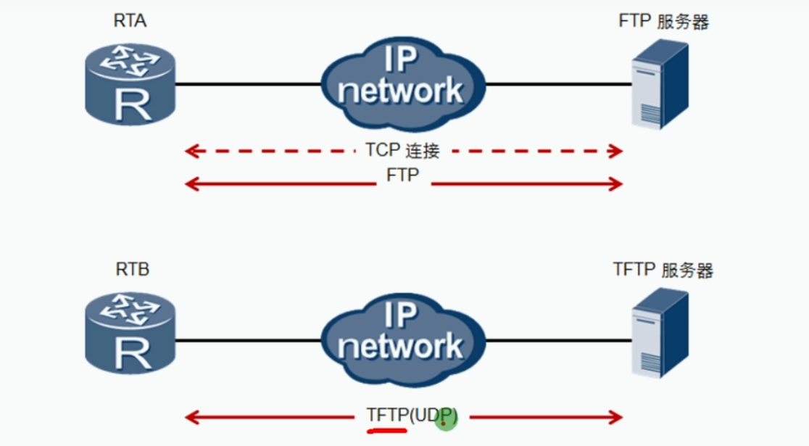
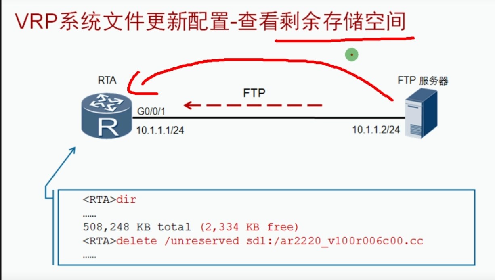

 https://www.bilibili.com/video/BV1Dg4y187bZ?p=27 

# VRP系统管理

### 前言

为了满足企业业务对网络的需求，网络设备中的系统文件需要不断进行升级。另外，网络设备中的配置文件也需要时常进行备份，以防止设备故障或者其他灾害给业务带来损害。在升级和备份系统文件或者配置文件时，经常会使用FTP和TFTP来传输文件。

* 随着VRP版本的更新，VRP支持的特性也越来越多，可根据需求更新VRP版本

```
<Huawei>dis ver
Huawei Versatile Routing Platform Software
VRP (R) software, Version 5.130 (AR2200 V200R003C00)
Copyright (C) 2011-2012 HUAWEI TECH CO., LTD
Huawei AR2220 Router uptime is 0 week, 0 day, 0 hour, 49 minutes
BKP 0 version information: 

```

### VRP命名规范

* 由VRP自身版本号和关联产品版本号两部分组成

* 产品版本格式包含Vxxx(产品码)，Rxxx(大版本号)，Cxx(小版本号)

* 如果VRP产品版本有补丁，VRP产品版本号中还会包括SPC部分

  | Version 5.90(AR2200V200R001C00)        | VRP版本为5.90，产品版本号为V200R001C00                       |
  | -------------------------------------- | ------------------------------------------------------------ |
  | Version 5.120(AR2200V200R003C00SPC200) | VRP版本为5.120，产品版本号为V200R003C00SPC00，此产品版本包含有补丁包 |

### 上传文件





