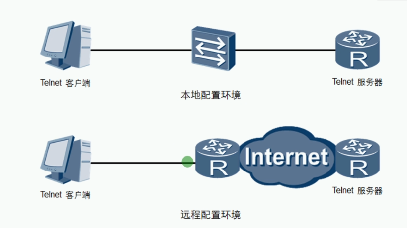
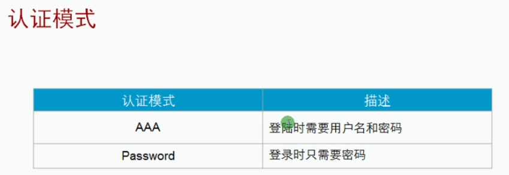

 https://www.bilibili.com/video/BV1Dg4y187bZ?p=25 

# VRP远程管理

|              命令              |          功能          |
| :----------------------------: | :--------------------: |
|        display version         |      显示系统版本      |
|          display user          |  显示已连接的终端用户  |
|          display this          | 显示当前视图的运行配置 |
| dispaly diagnostic-information |  显示设备所有状态信息  |

```bash
<Huawei>dis ver													## 显示系统信息
Huawei Versatile Routing Platform Software
VRP (R) software, Version 5.130 (AR200 V200R003C00)
Copyright (C) 2011-2012 HUAWEI TECH CO., LTD
Huawei AR201 Router uptime is 0 week, 0 day, 3 hours, 50 minutes	## 开机时间

MPU 0(Master) : uptime is 0 week, 0 day, 3 hours, 50 minutes
MPU version information : 
1. PCB      Version  : AR01SRU0A VER.A
2. MAB      Version  : 0
3. Board    Type     : AR201
4. BootROM  Version  : 0

<Huawei>dis users												## 显示链接终端用户
  User-Intf    Delay    Type   Network Address     AuthenStatus    AuthorcmdFlag
+ 0   CON 0   00:00:00                                   pass                   
  Username : Unspecified


<Huawei>sys
Enter system view, return user view with Ctrl+Z.
[Huawei]int lo1
[Huawei-LoopBack1]dis this										##显示当前视图的运行配置
[V200R003C00]
#
interface LoopBack1
 ip address 1.0.0.2 255.255.255.0 
#
return
[Huawei-LoopBack1]
```


## 前言

如果企业网络中有一台或多台网络设备需要远程进行配置和管理，管理员可以使用telnet远程连接到每一台设备上，对这些网络设备进行集中的管理和维护







```bash
## 真机请尽量不用使用这个命令

```

