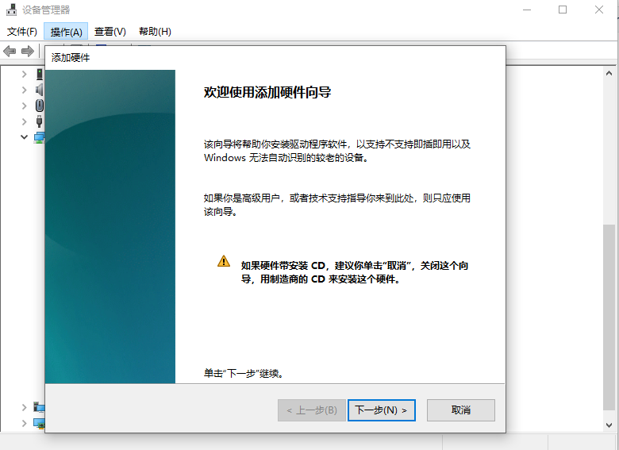
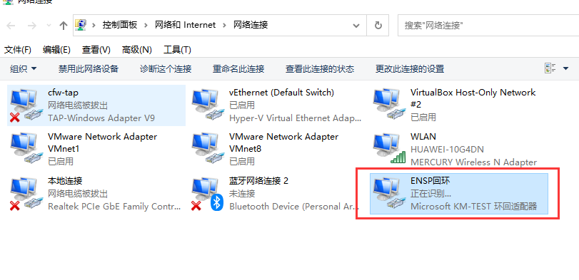

 https://www.bilibili.com/video/BV1Dg4y187bZ?p=25 

# VRP远程管理

|              命令              |          功能          |
| :----------------------------: | :--------------------: |
|        display version         |      显示系统版本      |
|          display user          |  显示已连接的终端用户  |
|          display this          | 显示当前视图的运行配置 |
| dispaly diagnostic-information |  显示设备所有状态信息  |

```bash
<Huawei>dis ver													## 显示系统信息
Huawei Versatile Routing Platform Software
VRP (R) software, Version 5.130 (AR200 V200R003C00)
Copyright (C) 2011-2012 HUAWEI TECH CO., LTD
Huawei AR201 Router uptime is 0 week, 0 day, 3 hours, 50 minutes	## 开机时间

MPU 0(Master) : uptime is 0 week, 0 day, 3 hours, 50 minutes
MPU version information : 
1. PCB      Version  : AR01SRU0A VER.A
2. MAB      Version  : 0
3. Board    Type     : AR201
4. BootROM  Version  : 0

<Huawei>dis users												## 显示链接终端用户
  User-Intf    Delay    Type   Network Address     AuthenStatus    AuthorcmdFlag
+ 0   CON 0   00:00:00                                   pass                   
  Username : Unspecified


<Huawei>sys
Enter system view, return user view with Ctrl+Z.
[Huawei]int lo1
[Huawei-LoopBack1]dis this										##显示当前视图的运行配置
[V200R003C00]
#
interface LoopBack1
 ip address 1.0.0.2 255.255.255.0 
#
return
[Huawei-LoopBack1]
```


## 前言

如果企业网络中有一台或多台网络设备需要远程进行配置和管理，管理员可以使用telnet远程连接到每一台设备上，对这些网络设备进行集中的管理和维护


| 命令                                      | 备注                |
| ----------------------------------------- | ------------------- |
| telnet server enable                      | 开启telnet服务      |
| display telnet server status              | 验证telnet服务      |
| user-interface vty 0 4                    | 进入VTY配置         |
| authentication-mode password/aaa          | 配置认证模式        |
| set authentication password cipher huawei | 配置认证密码        |
| user privilege level 15                   | 配置用户级别        |
| user-interface maximum-vty 15             | 配置最大VTY会话数量 |
| aaa                                       | 进入AAA配置模式     |
| local-user wakin password cipher huawei   | 创建用户和密码      |
| local-user wakin privilege level 15       | 配置用户级别        |
| local-user wakin service-type telnet      | 配置用户可用服务    |
|                                           |                     |

```bash
[Huawei]dis ip int br							##查看所有接口的利用率
*down: administratively down
^down: standby
(l): loopback
(s): spoofing
The number of interface that is UP in Physical is 2
The number of interface that is DOWN in Physical is 2
The number of interface that is UP in Protocol is 1
The number of interface that is DOWN in Protocol is 3

Interface                         IP Address/Mask      Physical   Protocol  
GigabitEthernet0/0/0              unassigned           up         down      
GigabitEthernet0/0/1              unassigned           down       down      
GigabitEthernet0/0/2              unassigned           down       down      
NULL0                             unassigned           up         up(s)     

[Huawei]int g0/0/1								## 进入g0/0/0接口
[Huawei-GigabitEthernet0/0/1]ip add 192.168.3.1 24
[Huawei-GigabitEthernet0/0/1]dis ip int br		  ## 查看接口
*down: administratively down
^down: standby
(l): loopback
(s): spoofing
The number of interface that is UP in Physical is 2
The number of interface that is DOWN in Physical is 2
The number of interface that is UP in Protocol is 2
The number of interface that is DOWN in Protocol is 2

Interface                         IP Address/Mask      Physical   Protocol  
GigabitEthernet0/0/0              192.168.108.33/24    down       down      
GigabitEthernet0/0/1              192.168.3.1/24       up         up        
GigabitEthernet0/0/2              unassigned           down       down      
NULL0                             unassigned           up         up(s)     
[Huawei-GigabitEthernet0/0/1]

####################################################################################
### 使用192.168.3.3的电脑ping路由器
PC>ping 192.168.3.1

Ping 192.168.3.1: 32 data bytes, Press Ctrl_C to break
From 192.168.3.1: bytes=32 seq=1 ttl=255 time=31 ms
From 192.168.3.1: bytes=32 seq=2 ttl=255 time=47 ms
From 192.168.3.1: bytes=32 seq=3 ttl=255 time=31 ms
From 192.168.3.1: bytes=32 seq=4 ttl=255 time=31 ms
From 192.168.3.1: bytes=32 seq=5 ttl=255 time=31 ms

--- 192.168.3.1 ping statistics ---
  5 packet(s) transmitted
  5 packet(s) received
  0.00% packet loss
  round-trip min/avg/max = 31/34/47 ms

PC>
####################################################################################


<Huawei>dis tel ser st							## 查看telnet服务
 TELNET IPV4 server                      :Enable
 TELNET IPV6 server                      :Enable
 TELNET server port                      :23

[Huawei]tel server enable 						## 开启telnet服务
 Error: TELNET server has been enabled			 ## 我这边已经开了所以has been enabled
 
##### 密码认证模式
[Huawei]user-in	
[Huawei]user-interface vty 0 4
[Huawei-ui-vty0-4]au	
[Huawei-ui-vty0-4]authentication-mode pa	
[Huawei-ui-vty0-4]authentication-mode password 
Please configure the login password (maximum length 16):123456
[Huawei-ui-vty0-4]us pri level 1				## 用户级别
[Huawei-ui-vty0-4]

[Huawei-ui-vty0-4]d th							## 显示当前视图的配置 display this
[V200R003C00]
#
user-interface con 0
 authentication-mode password
user-interface vty 0 4
 authentication-mode password
 user privilege level 1
 set authentication password cipher %$%$|*x66,~-2A=[5YNMKraM,*,:pUi$1J2KP/2mPO<Y
$fX<*,=,%$%$
user-interface vty 16 20
#
return
[Huawei-ui-vty0-4]

##### aaa模式
[Huawei]user-interface vty 0 4					  ## 进入VTY
[Huawei-ui-vty0-4]authentication-mode aaa		    ##修改模式为aaa
[Huawei]aaa										 ## 进入3A模式
[Huawei-aaa]local-user mm password ci			  
[Huawei-aaa]local-user mm password cipher mm123456	## 增加用户
Info: Add a new user.
[Huawei-aaa]local-user mm privilege level 15		## 设置级别
[Huawei-aaa]local-user mm service-type telnet		## 设置可用服务类型(可多选)
[Huawei-aaa]
[Huawei-aaa]dis this							  ##查看当前配置
[V200R003C00]
#
aaa 
 authentication-scheme default
 authorization-scheme default
 accounting-scheme default
 domain default 
 domain default_admin 
 local-user mm password cipher %$%$`puZ*AQ2a,uc/'NO\iG)UXCc%$%$
 local-user mm privilege level 15
 local-user mm service-type telnet
 local-user admin password cipher %$%$K8m.Nt84DZ}e#<0`8bmE3Uw}%$%$
 local-user admin service-type http
#
return
[Huawei-aaa]


####  删除账号
[Huawei-aaa]local-user test password cipher test123
Info: Add a new user.
[Huawei-aaa]undo local-user test					## 删除
[Huawei-aaa]dis this
[V200R003C00]
#
aaa 
 authentication-scheme default
 authorization-scheme default
 accounting-scheme default
 domain default 
 domain default_admin 
 local-user mm password cipher %$%$`puZ*AQ2a,uc/'NO\iG)UXCc%$%$
 local-user mm privilege level 15
 local-user mm service-type telnet
 local-user admin password cipher %$%$K8m.Nt84DZ}e#<0`8bmE3Uw}%$%$
 local-user admin service-type http
#
return
[Huawei-aaa]

#### 服务类型大全
[Huawei-aaa]local-user mm service-type ?
  8021x     802.1x user
  bind      Bind authentication user
  ftp       FTP user
  http      Http user
  ppp       PPP user
  ssh       SSH user
  sslvpn    Sslvpn user
  telnet    Telnet  user
  terminal  Terminal user
  web       Web authentication user
  x25-pad   X25-pad user
[Huawei-aaa]local-user mm service-type 

```

ENSP通过回环网卡连接真机



一直下一步到这个界面


重命名网卡



```bash
## 真机请尽量不用使用这个命令

```

