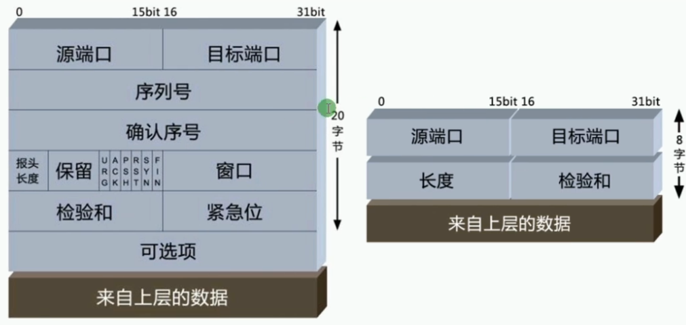
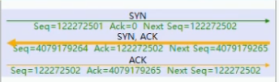
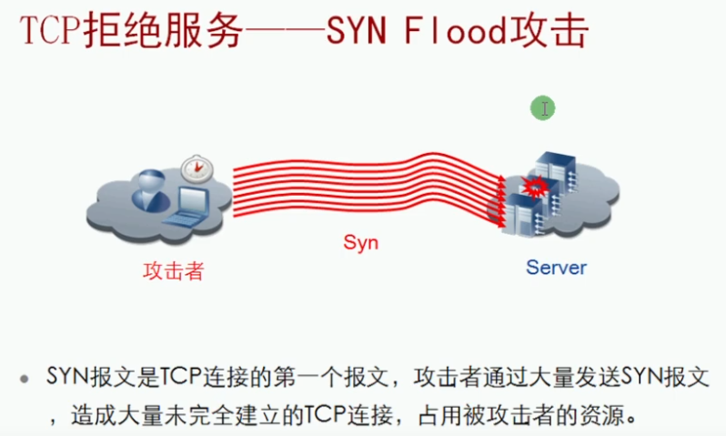
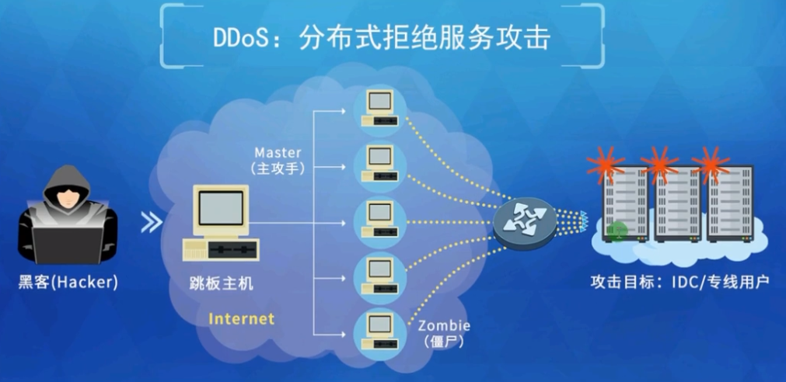
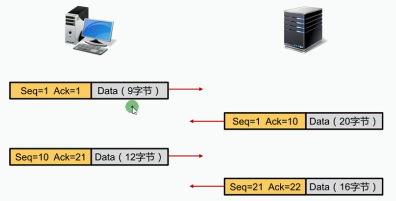
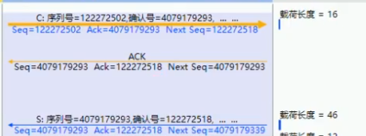
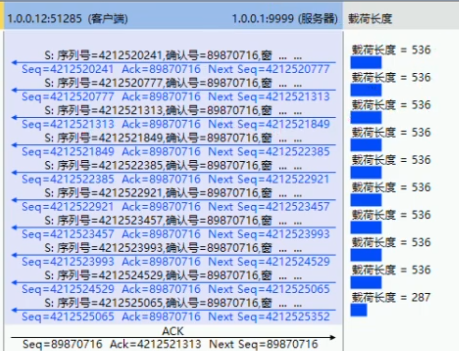
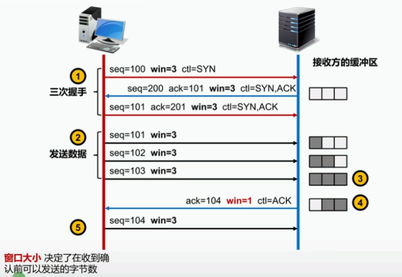
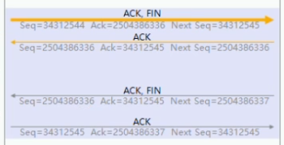
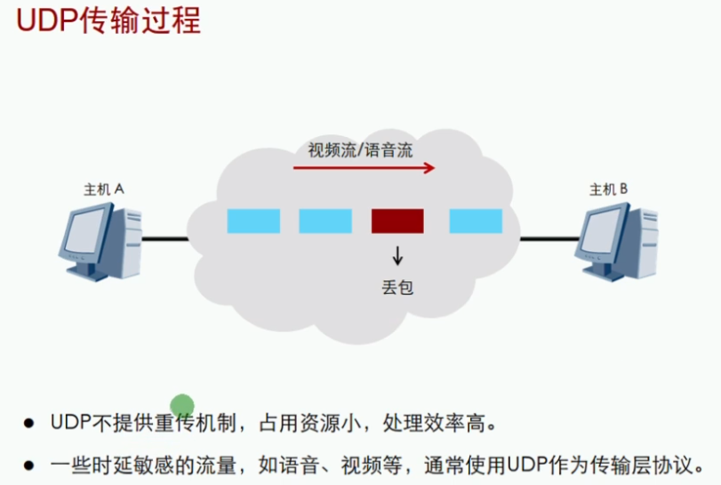

 https://www.bilibili.com/video/BV1Dg4y187bZ?p=10 

# 传输层

## 前言

传输层定义了主机应用程序之间端到端的连通性。传输层中最为常见的两个协议费根鞋是传输控制协议TCP和用户数据包协议UDP

### 传输层概述

* 传输层提供端到端的连接
* 网络层提供点到点的连接

### 传输层端口：Port


|  端口号   |  应用程序   |
| :-------: | :---------: |
|   5900    | VNC(服务器) |
| 8000(UDP) |     QQ      |
|   54385   | VNC(客户端) |

即使用TCP又使用UDP的应用层协议又哪些？DNS、SNMP....

windows查看端口使用情况


#### 使用telnet命令探测端口号

```bash
telnet 127.0.0.1 22
//     地址	   端口号
```

#### 使用专业工具探测端口号


### 传输层协议

| 协议 |                             备注                             |
| :--: | :----------------------------------------------------------: |
| TCP  | 传输控制层协议：可靠的面向连接的协议。传输效率低，类似打电话 |
| UDP  | 用户数据报协议：不可靠的，无连接的服务。传输笑了高，类似群聊 |


### TCP和UDP数据包结构对比



### TCP

### TCP会话的建立-三次握手


1.客户端发送	SYN(同步位)+seq(序列号)

2.服务器发送	ACK(确认)+ack(确认号=客户端序列号+1)	+	SYN(同步位)+seq(序列号)

3.客户端发送	ACK(确认)+ack(确认号=服务器序列号+1)	+	seq(序列号=客户端序列号+1)



##### TCP拒绝服务-SYN Flood攻击





### TCP会话的确认



1.客户端发送：Seq(序列号)+Ack(确认号)+Data(数据9字节)

2.服务器发送：Seq(序列号=上次Ack)+Ack(确认号=客户端Data.length+1)+Data(数据20字节)

3.客户端发送：Seq(序列号=上次Ack)+Ack(确认号=服务器Data.length+1)+Data(数据12字节)

4.服务器发送：Seq(序列号=上次Ack)+Ack(确认号=客户端Data.length+1)+Data(数据16字节)



多条数据确认：当服务器同时发送多个包给客户端时，客户端会多个包一起确认

如下图，最下面的是1313和第二行的next seq是一样的



### TCP会话的拥塞和流量控制



win：窗口大小，告诉对方自己一次性可以接收多少个字节

### TCP四次分手(不一定4个)



## UDP



## TCP和UDP的对比

|        TCP         |       UDP        |
| :----------------: | :--------------: |
|      面向连接      |      无连接      |
|      可靠传输      |  尽力而为的传输  |
| 支持流控及窗口机制 | 无流控及窗口机制 |
|    HTTP、FTP等     | TFTP、DNS、DHCP  |

