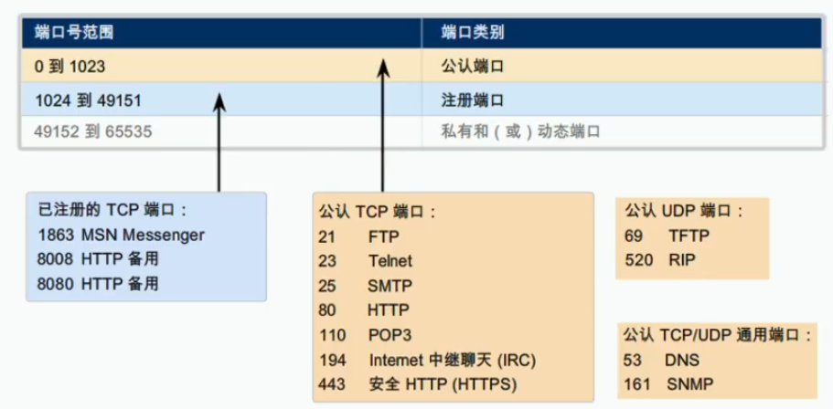
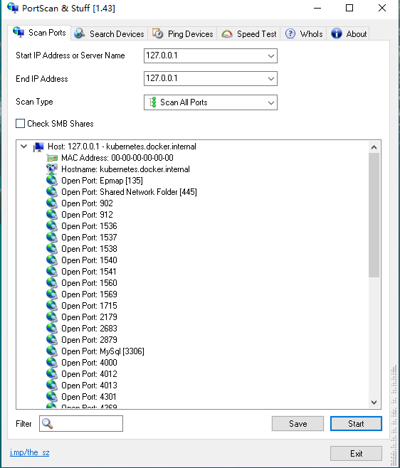
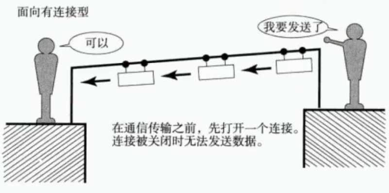
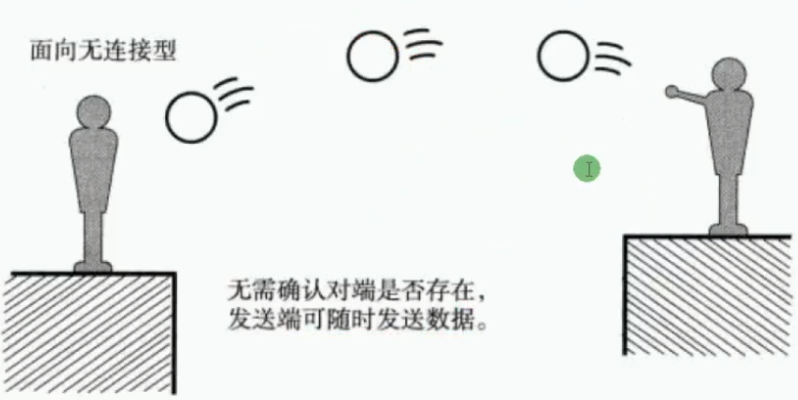

 https://www.bilibili.com/video/BV1Dg4y187bZ?p=10 

# 传输层

## 前言

传输层定义了主机应用程序之间端到端的连通性。传输层中最为常见的两个协议费根鞋是传输控制协议TCP和用户数据包协议UDP

### 传输层概述

* 传输层提供端到端的连接
* 网络层提供点到点的连接

### 传输层端口：Port




|  端口号   |  应用程序   |
| :-------: | :---------: |
|   5900    | VNC(服务器) |
| 8000(UDP) |     QQ      |
|   54385   | VNC(客户端) |

即使用TCP又使用UDP的应用层协议又哪些？DNS、SNMP....

windows查看端口使用情况


#### 使用telnet命令探测端口号

```bash
telnet 127.0.0.1 22
//     地址	   端口号
```

#### 使用专业工具探测端口号



### 传输层协议

| 协议 |                             备注                             |
| :--: | :----------------------------------------------------------: |
| TCP  | 传输控制层协议：可靠的面向连接的协议。传输效率低，类似打电话 |
| UDP  | 用户数据报协议：不可靠的，无连接的服务。传输笑了高，类似群聊 |





