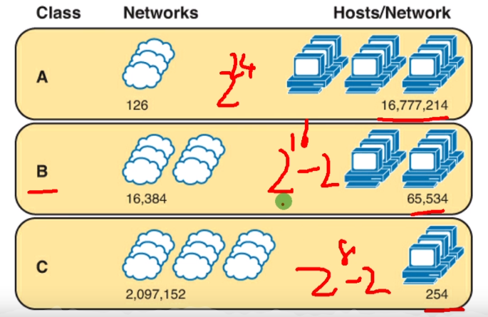
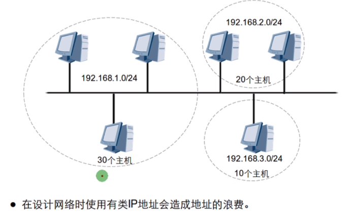
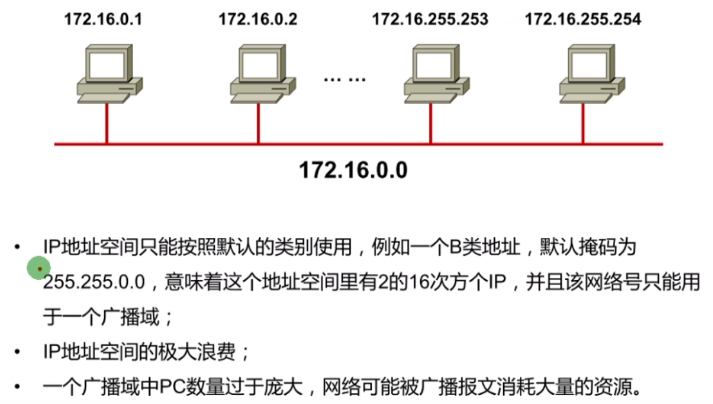
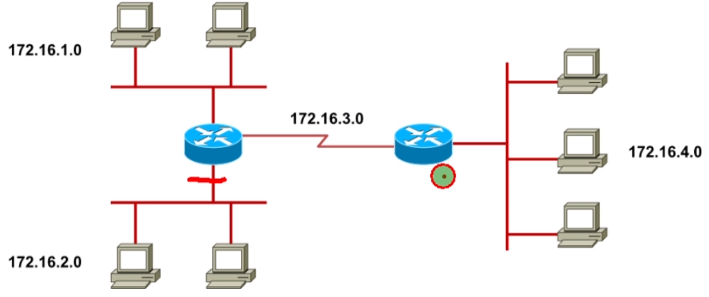

 https://www.bilibili.com/video/BV1Dg4y187bZ?p=20 

# 子网划分

### 有类IP地址规划的缺陷：为什么要子网划分

### 子网划分概述

* 满足不同网络对IP地址的需求
* 实现网络的层次性
* 节省IP地址
* 默认子网掩码可以进一步划分，变成长子网掩码
* 即网络位向主机位的借位

题目：已知一个局域网中由1000台客户端，如果把他放在同一网段中，请问用什么子网掩码比较合适_22__

2^X -2 >1000	x=10	

题目：IP地址为：192.168.1.100/29，则广播地址为____;可用IP数为____;

29-4=5位 划分32个子网，每个子网6台主机

网络地址：

主机地址：

广播地址：

# 子网划分练习

