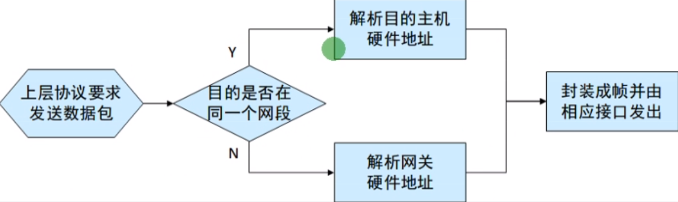
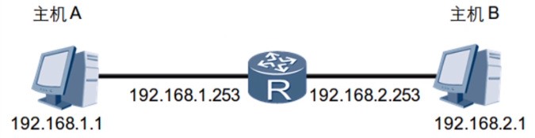
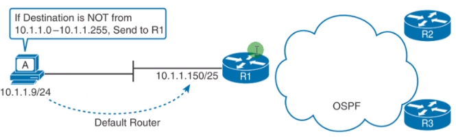

 https://www.bilibili.com/video/BV1Dg4y187bZ?p=21 

# 数据转发过程

### 前言

TCP/IP协议簇和底层协议配合，保证了数据能够实现端到端的传输。数据传输过程是非常复杂的过程，例如数据在转发的过程中会进行一系列的封装和解封装。对于网络工程师来说，只有深入地理解了数据在各种不同设备上的转发过程，才能够对网络进行正确地分析和检测。

### 网关

* 位于不同网络间地主机实现通讯，必须把数据包发送给网关
* 网关通常就是一台三层网络设备（路由器，三层交换机，防火墙）
* 网关地地址就是设备地接口地址

