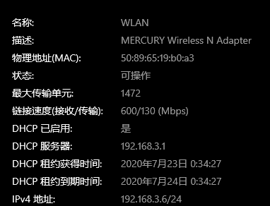
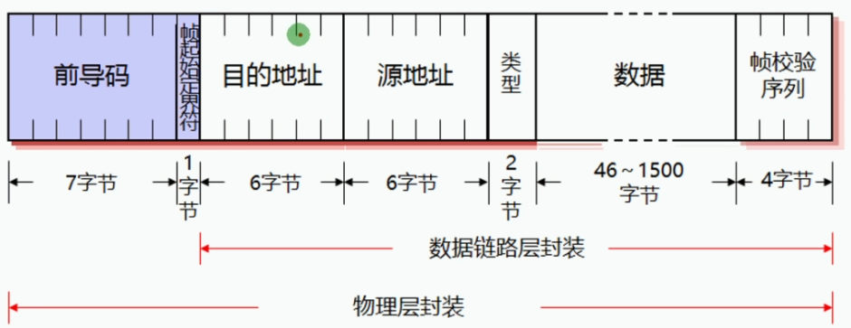
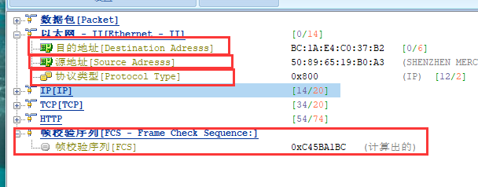
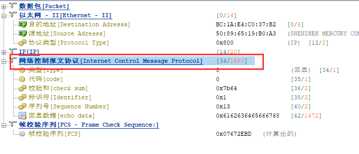
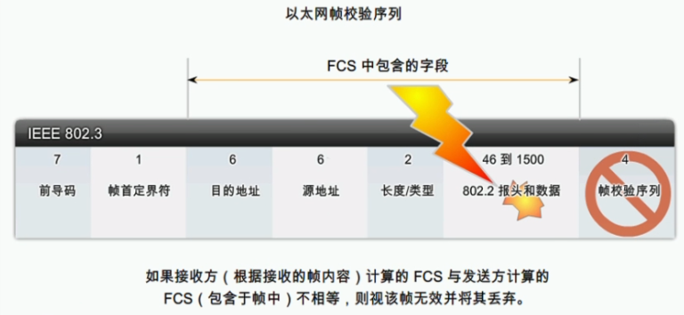
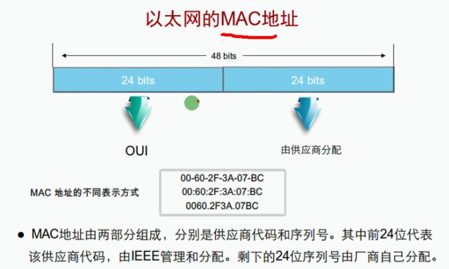
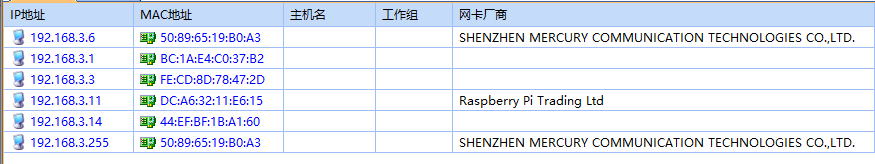
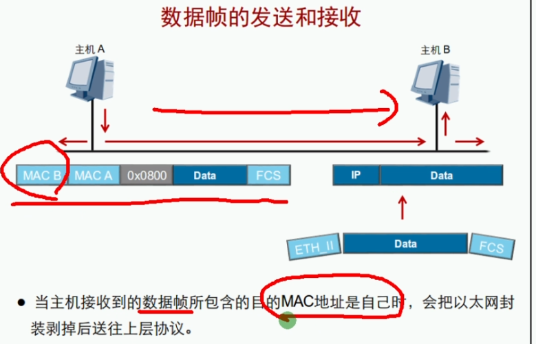

 https://www.bilibili.com/video/BV1Dg4y187bZ?p=11 

# 数据链路层和以太网

## 以太网：Ethernet,当今主导地位的局域网组网技术


## 以太网的发展史


* 20世纪70年代，由Xerox公司联合Intel和DEC公司开发出以太网

* 1973年，传输速率3Mb/s(实验室)

* 1980年，传输速率10Mb/s

* 1990年，出现双绞线介质的以太网

* 1992年，传输速率100Mb/s

* 1998年，传输速率1000Mb/s

* 2010年，IEEE发布40G/100G标准

* 2013年，400G的以太网标准工作正式启动

  

## 以太网的分类

| DIX以太网    | 10Mbit/s以太网     | 使用CSMA/CD         |
| ------------ | ------------------ | ------------------- |
| IEEE 802.3   |                    |                     |
| IEEE 802.3u  | 100Mbit/s以太网    | 可以选择使用CSMA/CD |
| IEEE 802.3z  | 1Gbit/s以太网      |                     |
| IEEE 802.3ae | 10Gbit/s以太网     | 不使用CSMA/CD       |
| IEEE 802.3ba | 40/100Gbit/s以太网 |                     |


## 数据链路层的分层设计


| LLC  | 逻辑链路控制:负责识别网络层的协议类型，接收上层数据包封装成帧后，向下层传递 |
| ---- | ------------------------------------------------------------ |
| MAC  | 介质访问控制:负责控制与连接物理层的物理介质，处理硬件设备的物理寻址、定义网络拓扑及数据帧的传递顺序 |

 



### 以太网帧结构





| 协议类型   | 代表上层的协议(0800 IP)                            |
| ---------- | -------------------------------------------------- |
| 帧大小范围 | 64-1518                                            |
| MTU        | 最大传输单元，默认1500字节，每次发送的数据的最大值 |
| 帧校验     | 通过一定的计算公式对数据包进行计算                 |
| MAC地址    | 代表一个网络接口的物理地址，全球唯一               |
|            |                                                    |

#### 测试最大传输

发送2000字节最后总的数据包不会超过1518，数据会被分片

```bash
C:\Users\computer>ping www.baidu.com -l 2000

正在 Ping www.a.shifen.com [180.101.49.12] 具有 2000 字节的数据:
请求超时。
请求超时。
请求超时。
请求超时。

180.101.49.12 的 Ping 统计信息:
    数据包: 已发送 = 4，已接收 = 0，丢失 = 4 (100% 丢失)，

C:\Users\computer>
```



#### 校验



#### Mac地址







