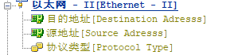
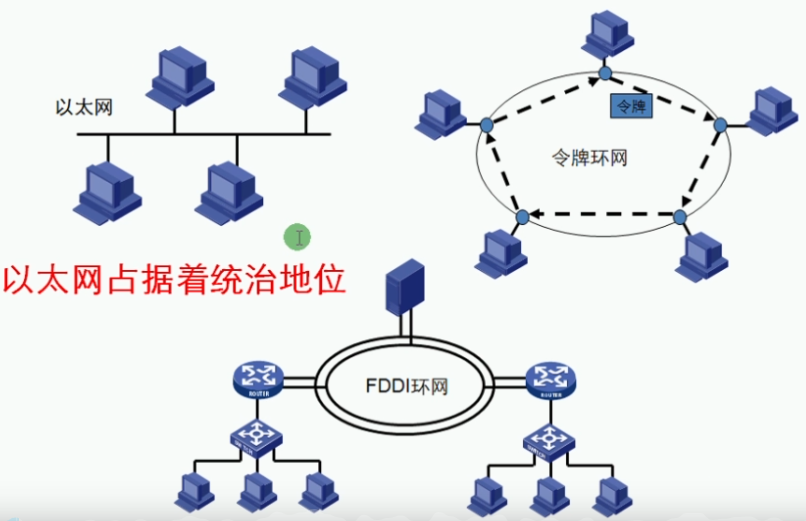
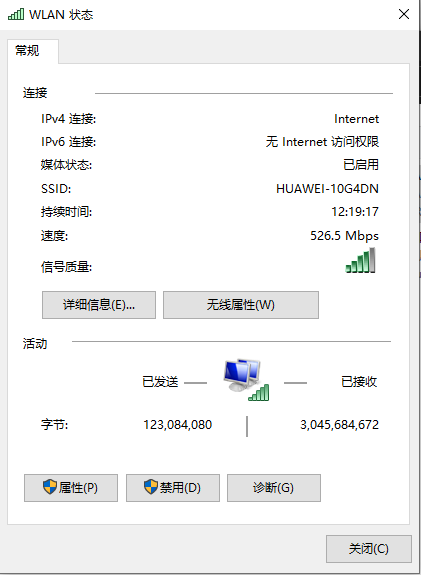
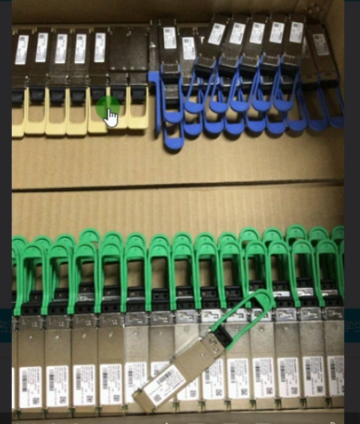
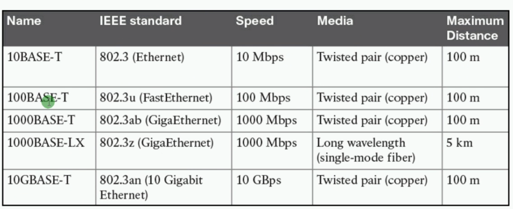
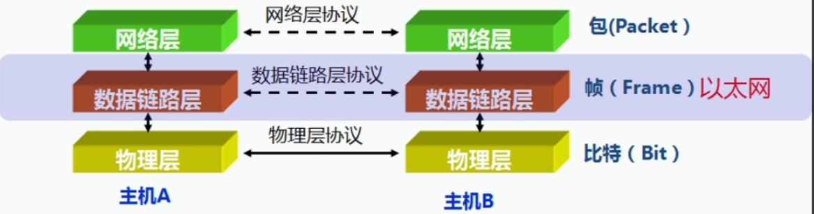

 https://www.bilibili.com/video/BV1Dg4y187bZ?p=11 

# 数据链路层和以太网

## 以太网：Ethernet,当今主导地位的局域网组网技术

## 以太网的发展史

* 20世纪70年代，由Xerox公司联合Intel和DEC公司开发出以太网

* 1973年，传输速率3Mb/s(实验室)

* 1980年，传输速率10Mb/s

* 1990年，出现双绞线介质的以太网

* 1992年，传输速率100Mb/s

* 1998年，传输速率1000Mb/s

* 2010年，IEEE发布40G/100G标准

* 2013年，400G的以太网标准工作正式启动

  

## 以太网的分类

| DIX以太网    | 10Mbit/s以太网     | 使用CSMA/CD         |
| ------------ | ------------------ | ------------------- |
| IEEE 802.3   |                    |                     |
| IEEE 802.3u  | 100Mbit/s以太网    | 可以选择使用CSMA/CD |
| IEEE 802.3z  | 1Gbit/s以太网      |                     |
| IEEE 802.3ae | 10Gbit/s以太网     | 不使用CSMA/CD       |
| IEEE 802.3ba | 40/100Gbit/s以太网 |                     |

## 数据链路层的分层设计

| LLC  | 逻辑链路控制:负责识别网络层的协议类型，接收上层数据包封装成帧后，向下层传递 |
| ---- | ------------------------------------------------------------ |
| MAC  | 介质访问控制:负责控制与连接物理层的物理介质，处理硬件设备的物理寻址、定义网络拓扑及数据帧的传递顺序 |

 