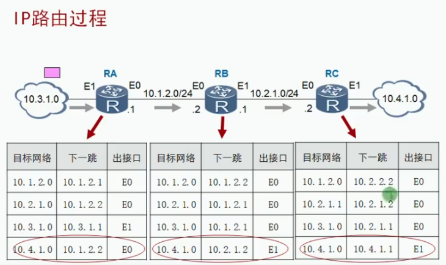
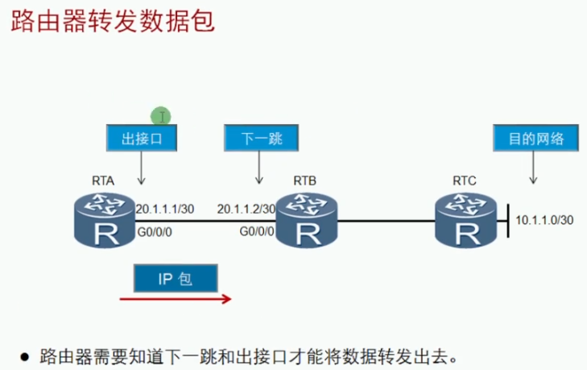
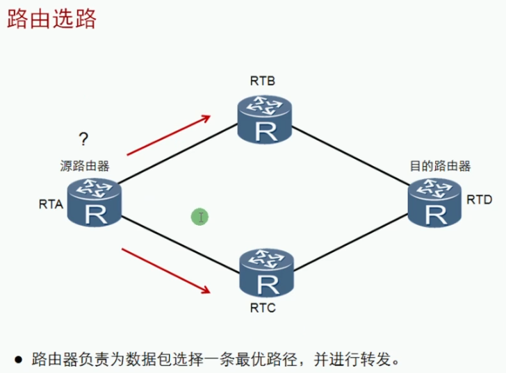
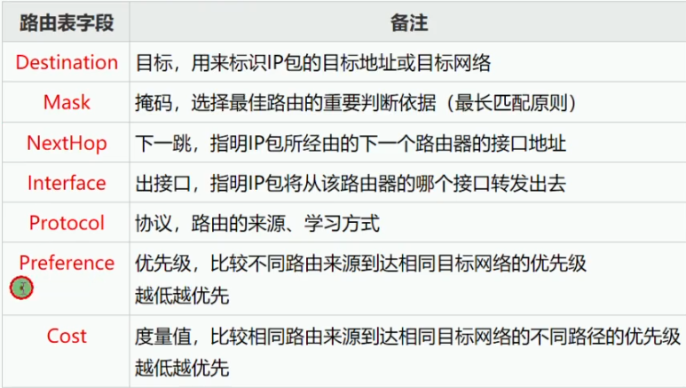
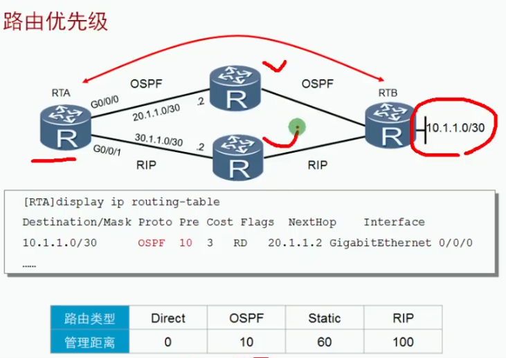
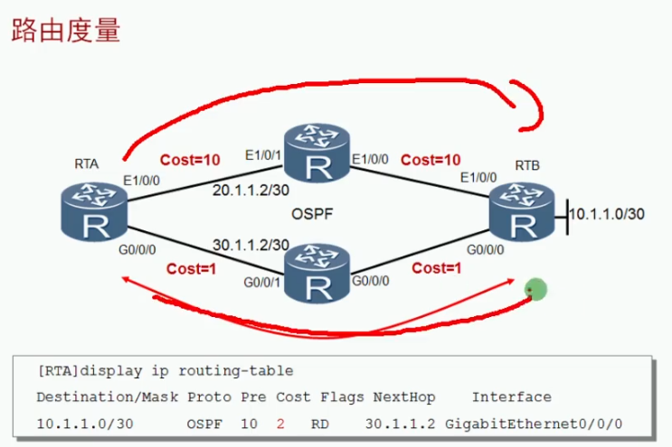
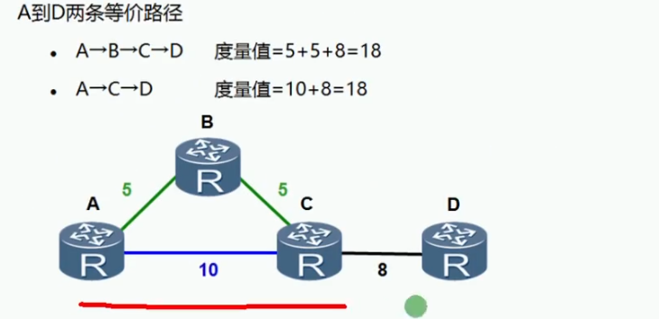
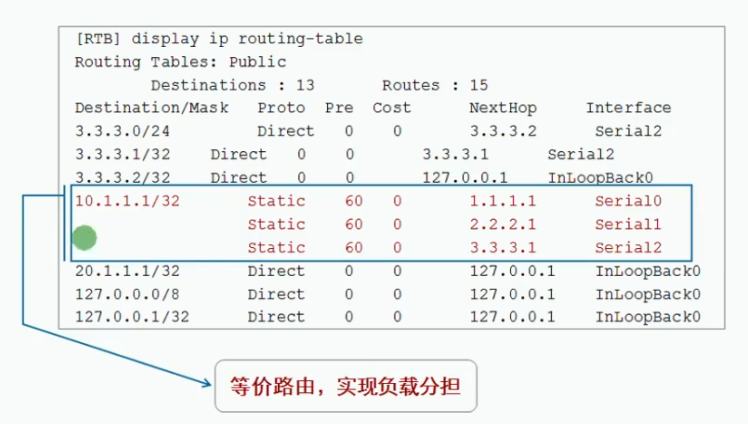
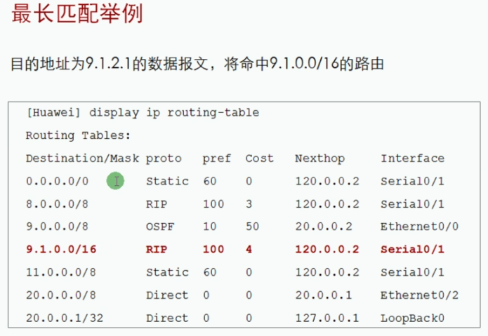
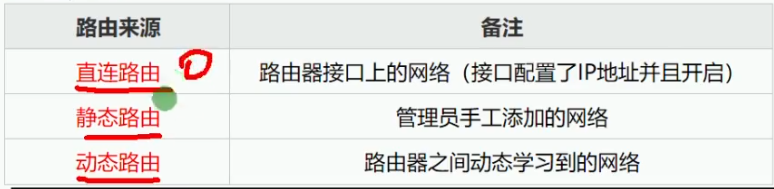

 https://www.bilibili.com/video/BV1Dg4y187bZ?p=28 

# 路由基础

## 前言

路由技术是Internet得以持续运转的关键所在。

路由是及其有趣而又复杂的课题，永远的话题。

企业网络的拓扑结构一般会比较复杂，不同的部门，或者总部和分支可能处在不同的网络中，此时就需要使用路由器来连接不同的网络，实现网络之间的数据转发。

------

合肥去上海（不同网络）

去火车站买票（找网关）

询问售票员是否有票，查询时刻表（路由表）

有票，坐火车（出站）

无票（放弃）

------

| 术语     | 备注                                     | 类比         |
| -------- | ---------------------------------------- | ------------ |
| 路由     | 从源头到目标的路径，不同网络间的转发过程 | 火车         |
| 路由表   | 路由信息的集合，路由的依据               | 时刻表       |
| 路由器   | 具有路由功能的设备                       | 火车站       |
| 默认网关 | 通常是路由设备的接口IP地址               | 火车站的地址 |

### 路由过程图解



------

当路由器（或其他三层设备）收到一个IP数据包时，会查看数据报的IP头部中的目的IP地址，并在路由表中进行查找，在匹配到最优的路由后，将数据包扔给该路由所指的出接口或者下一跳。

------





### 路由表解析

| 命令                 | 备注 |
| -------------------- | ---- |
| dis ip routing-table |      |
|                      |      |
|                      |      |







### 等价路由





### 最长匹配原则



9.1.2.1

8.0.0.0/8（至少前8位一致）

9.0.0.0/8（至少前8位一致）

9.1.0.0/16（至少前16位一致）

9.1.2.1：     00001001 00000001 00000010 00000001

8.0.0.0/8：  00001000 00000000 00000000 00000000

9.0.0.0/8：  00001001 00000000 00000000 00000000		匹配（15位）	-》 00001001 0000000

9.1.0.0/16：00001001 00000001 00000000 00000000		匹配（22位）	-》 00001001 00000001 000000

0.0.0.0/0：  00000000 00000000 00000000 00000000		匹配（4位）

选择最长匹配

## 路由表的形成、路由的来源



```bash
<Huawei>dis ip routing-table 							## 查看路由表
Route Flags: R - relay, D - download to fib
------------------------------------------------------------------------------
Routing Tables: Public
         Destinations : 4        Routes : 4        

Destination/Mask    Proto   Pre  Cost      Flags NextHop         Interface

      127.0.0.0/8   Direct  0    0           D   127.0.0.1       InLoopBack0
      127.0.0.1/32  Direct  0    0           D   127.0.0.1       InLoopBack0
127.255.255.255/32  Direct  0    0           D   127.0.0.1       InLoopBack0
255.255.255.255/32  Direct  0    0           D   127.0.0.1       InLoopBack0

<Huawei>
[Huawei-GigabitEthernet0/0/1]ip add 192.168.3.50 24			## 增加
Jul 29 2020 04:18:44-08:00 Huawei %%01IFNET/4/LINK_STATE(l)[0]:The line protocol
 IP on the interface GigabitEthernet0/0/1 has entered the UP state. 
[Huawei-GigabitEthernet0/0/1]
[Huawei]dis ip routing-table 							## 查看路由表
Route Flags: R - relay, D - download to fib
------------------------------------------------------------------------------
Routing Tables: Public
         Destinations : 7        Routes : 7        

Destination/Mask    Proto   Pre  Cost      Flags NextHop         Interface

      127.0.0.0/8   Direct  0    0           D   127.0.0.1       InLoopBack0
      127.0.0.1/32  Direct  0    0           D   127.0.0.1       InLoopBack0
127.255.255.255/32  Direct  0    0           D   127.0.0.1       InLoopBack0
    192.168.3.0/24  Direct  0    0           D   192.168.3.50    GigabitEthernet
0/0/1
   192.168.3.50/32  Direct  0    0           D   127.0.0.1       GigabitEthernet
0/0/1
  192.168.3.255/32  Direct  0    0           D   127.0.0.1       GigabitEthernet
0/0/1
255.255.255.255/32  Direct  0    0           D   127.0.0.1       InLoopBack0

[Huawei]

```

