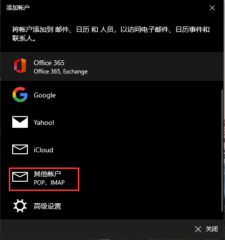

 https://www.bilibili.com/video/BV1Dg4y187bZ?p=7 

# 邮件服务

### 邮件服务

| 协议 |                 备注                 |
| :--: | :----------------------------------: |
| SMTP |   简单的邮件传输协议(用于发送邮件)   |
| POP3 |     邮局协议版本3(用于接收邮件)      |
| IMAP | 互联网邮件访问协议类似POP3，功能更多 |

### IMAP和POP有什么区别

POP允许电子邮件客户端下载服务器上的邮件，但是您在电子邮件客户端的操作（如：移动邮件、标记已读等），这是不会反馈到服务器上的，比如：您通过电子邮件客户端收取了QQ邮箱中的3封邮件并移动到了其他文件夹，这些移动动作是不会反馈到服务器上的，也就是说，QQ邮箱服务器上的这些邮件是没有同时被移动的 。但是IMAP就不同了，电子邮件客户端的操作都会反馈到服务器上，您对邮件进行的操作（如：移动邮件、标记已读等），服务器上的邮件也会做相应的动作。也就是说，IMAP是“双向”的。

同时，IMAP可以只下载邮件的主题，只有当您真正需要的时候，才会下载邮件的所有内容。

### Windows邮件添加QQ邮箱

点击设置->账户

开启IMAP

打开Windows邮件->添加账户

选择其他账户

填入信息

开启同步设置就可以看到之前发的邮件了

